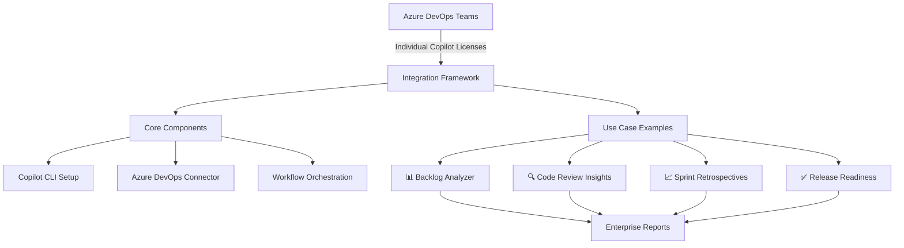
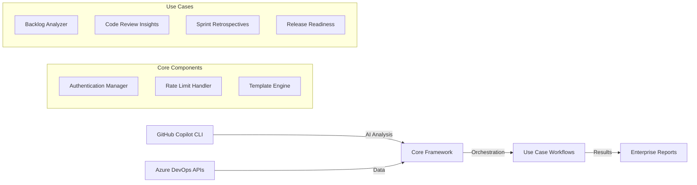

# 🚀 GitHub Copilot CLI Integration for Azure DevOps

> **Maximize Your Copilot Investment Without Platform Migration**

Bridge GitHub Copilot's AI capabilities with your existing Azure DevOps workflows. This enterprise-ready framework enables teams to leverage GitHub Copilot CLI for AI-powered DevOps automation while staying on Azure DevOps.

## 🎯 **Strategic Value for Azure DevOps Teams**

### 💡 **Copilot Seat Amplification**
- **Transform individual licenses** into team-wide AI capabilities
- **CLI agent scales better** than individual IDE usage  
- **Enterprise AI workflows** without GitHub Enterprise migration
- **ROI maximization** from existing Copilot subscriptions

### 🔄 **Best of Both Worlds**
- **Azure DevOps process maturity** + **GitHub Copilot AI innovation**
- **No migration pressure** - work within existing governance
- **Prove AI value** before making platform decisions
- **Bridge solution** for hybrid DevOps environments

### 🏢 **Enterprise-Grade Framework**
- **Modular architecture** with reusable components
- **Multiple use cases** from core integration pattern
- **Secure authentication** handling dual platform access
- **Scalable deployment** from individual teams to enterprise

---

## 🔧 **Framework Architecture**



**Core Framework:**
- **🔧 Copilot CLI Setup** → Authentication, rate limiting, environment management
- **🔌 Azure DevOps Connector** → Work items, pull requests, builds, releases
- **⚡ Workflow Orchestration** → Reusable templates, error handling, reporting

**Proven Use Cases:**
- **📊 Backlog Analyzer** → AI-powered work item quality analysis (flagship example)
- **🔍 Code Review Insights** → Copilot-driven PR review automation  
- **📈 Sprint Retrospectives** → AI-generated team performance insights
- **✅ Release Readiness** → Intelligent deployment risk assessment

---

## 🚀 **Quick Start - Backlog Analyzer**

### 1️⃣ **Prerequisites**
- ✅ Individual GitHub Copilot subscription
- ✅ Azure DevOps organization access
- ✅ GitHub Personal Access Token ([create here](https://github.com/settings/tokens))

### 2️⃣ **Framework Setup**
```powershell
# Clone the integration framework
git clone https://github.com/your-org/copilot-azuredevops-integration.git
cd copilot-azuredevops-integration

# Deploy backlog analyzer use case
.\use-cases\backlog-analyzer\backlog-analyzer-IMPROVED.yml
```

### 3️⃣ **Run Analysis**
- Go to **Azure DevOps** → **Pipelines** → **Backlog Analyzer**  
- Click **Run Pipeline** → Set parameters → **Run**
- Download AI analysis report from **Artifacts**

---

## 🎨 **Sample Output - Backlog Analysis**

```markdown
# 📋 Backlog Analysis Report

## Work Item #12345: User Login Enhancement

**Quality Score: 6/10** ⚠️ Needs Improvement

### INVEST Analysis
- ✅ **Independent**: Can be developed standalone
- ❌ **Negotiable**: Acceptance criteria too rigid  
- ✅ **Valuable**: Clear business value
- ⚠️ **Estimable**: Missing story points
- ❌ **Small**: Too large for single sprint
- ❌ **Testable**: Vague acceptance criteria

### 🎯 Top Recommendation
Split into smaller stories: "Login UI", "Authentication API", "Password Reset"

### 📝 Quality Issues
1. Acceptance criteria lacks specific scenarios
2. No error handling requirements specified  
3. Missing non-functional requirements (performance, security)
```

---

## 📋 **Use Case Configurations**

### 🏢 **Enterprise Teams (Backlog Analysis)**
```yaml
# Standard enterprise backlog analysis
parameters:
  analysisMode: 'governance'
  maxWorkItems: 200
  includeCompliance: true
  notificationRecipients: 'team-leads@company.com'
```

### 👥 **Agile Teams (Sprint Focus)**
```yaml
# Sprint-focused analysis  
parameters:
  analysisMode: 'standard'
  maxWorkItems: 50
  scopeFilter: 'current-sprint'
  generateCharts: true
```

### 🔍 **Code Review Insights** *(Coming Soon)*
```yaml
# AI-powered PR analysis
parameters:
  reviewScope: 'last-30-days'
  includeCodeQuality: true
  focusAreas: 'security,performance,maintainability'
```

---

## 🎯 **Target Scenarios**

| **Your Situation** | **Framework Value** | **Recommended Use Case** |
|--------------------|---------------------|-------------------------|
| **Individual Copilot user in Azure DevOps org** | Amplify your license across team workflows | Start with Backlog Analyzer |
| **Team evaluating GitHub Copilot ROI** | Prove value without platform migration | Multiple use cases for comprehensive demo |
| **Enterprise with Azure DevOps governance** | AI innovation within existing processes | Enterprise workflows with compliance |
| **Hybrid DevOps environment** | Bridge GitHub AI with Azure DevOps maturity | Full framework deployment |

---

## 🛠️ **Framework Extension**

### **Adding New Use Cases**
```bash
# Use the framework pattern
copilot-azuredevops-integration/
├── core/                    # Reusable components
│   ├── components/          # Modular templates
│   └── workflows/           # Pre-composed patterns
├── use-cases/
│   ├── backlog-analyzer/    # Flagship example
│   ├── code-review-insights/# Planned use case
│   ├── sprint-retrospectives/# Planned use case
│   └── release-readiness/   # Planned use case
└── docs/                    # Framework documentation
```

### **Custom AI Prompts**
```yaml
# Extend analysis capabilities
customPrompts:
  businessValue: "Analyze ROI and business impact..."
  technicalDebt: "Identify maintenance risks..."
  complianceCheck: "Validate regulatory requirements..."
```

---

## 🔧 **Architecture Deep Dive**



**Integration Benefits:**
1. **Single Authentication** → Handles both GitHub and Azure DevOps tokens
2. **Rate Limit Management** → Maximizes Copilot CLI usage efficiency  
3. **Template Reusability** → Consistent patterns across use cases
4. **Enterprise Reporting** → Unified dashboards and metrics

---

## 📚 **Documentation & Resources**

| **Resource** | **Purpose** |
|--------------|-------------|
| [docs/FRAMEWORK-DEVELOPMENT.md](docs/FRAMEWORK-DEVELOPMENT.md) | Framework architecture and extension patterns |
| [use-cases/backlog-analyzer/](use-cases/backlog-analyzer/) | Complete backlog analysis implementation |  
| [core/components/](core/components/) | Reusable framework components |
| [use-cases/backlog-analyzer/samples/](use-cases/backlog-analyzer/samples/) | Example outputs and configurations |

---

## 🚀 **Getting Started Paths**

### **Path 1: Quick Value (Individual Users)**
```bash
# Deploy backlog analyzer in 5 minutes
git clone [repo] && cd use-cases/backlog-analyzer
.\setup.ps1 -QuickStart
```

### **Path 2: Team Adoption (Multiple Use Cases)**  
```bash
# Deploy framework with multiple examples
# Use core workflows with different use case configurations
az pipelines run --name "core/workflows/standard-analysis"
```

### **Path 3: Enterprise Rollout (Full Framework)**
```bash
# Complete framework with governance
az pipelines run --name "core/workflows/enterprise-analysis" --parameters @enterprise-params.json
```

---

## 🤝 **Contributing & Extension**

**Framework Contributions:**
- 🔧 **Core Components** → Authentication, connectors, orchestration
- 📊 **Use Case Examples** → New AI-powered DevOps scenarios  
- 📚 **Documentation** → Deployment guides, best practices

**Community Use Cases:**
- Sprint planning optimization
- Release risk assessment  
- Technical debt analysis
- Team productivity insights

---

## 📄 **License & Support**

MIT License - Enterprise-friendly for organizational deployment

**Support Channels:**
- 📖 [Documentation Wiki](../../wiki)
- 🐛 [Issue Tracker](../../issues) 
- 💬 [Discussions](../../discussions)
- 📧 Enterprise support available

---

**🎯 Ready to amplify your Copilot investment? Start with the backlog analyzer and expand to full framework adoption!**